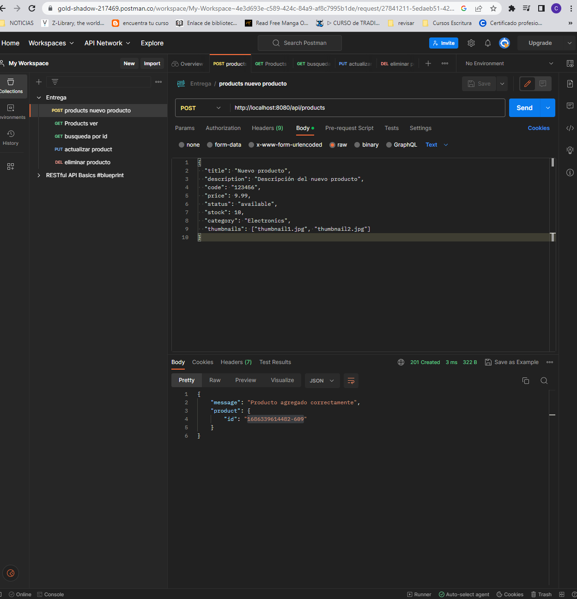
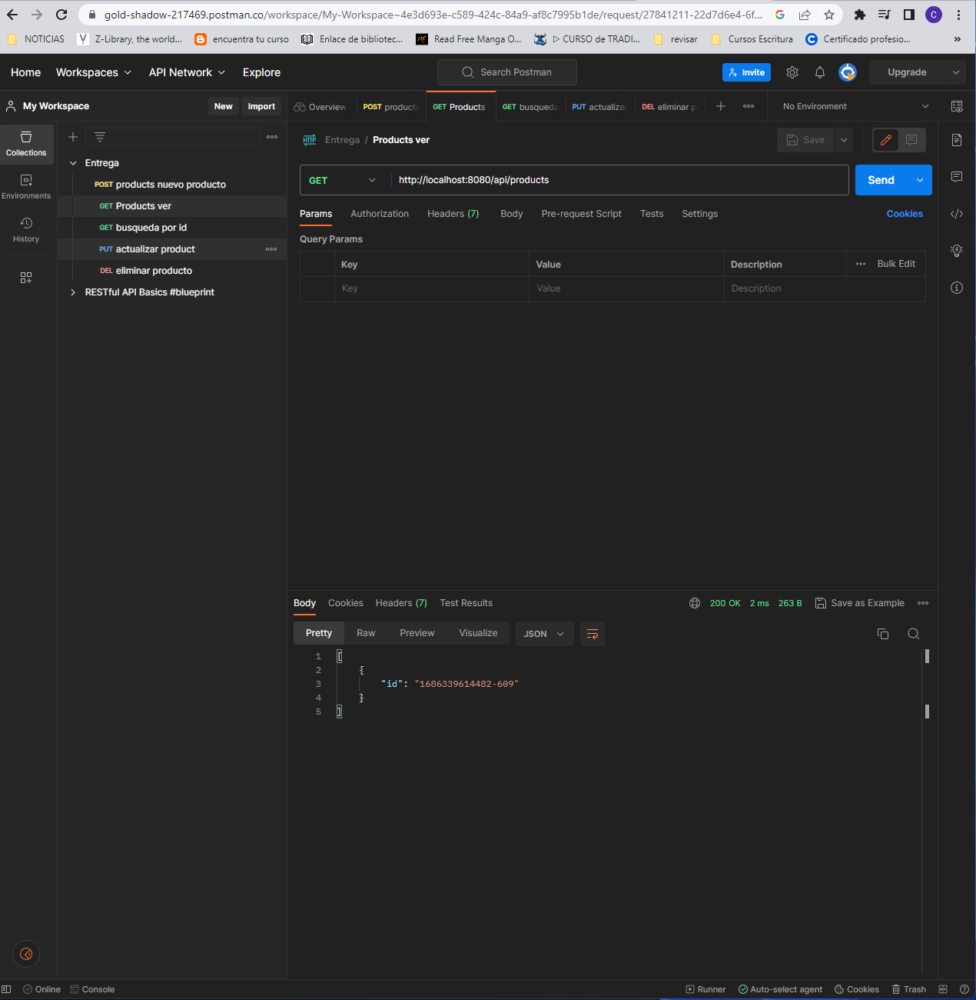
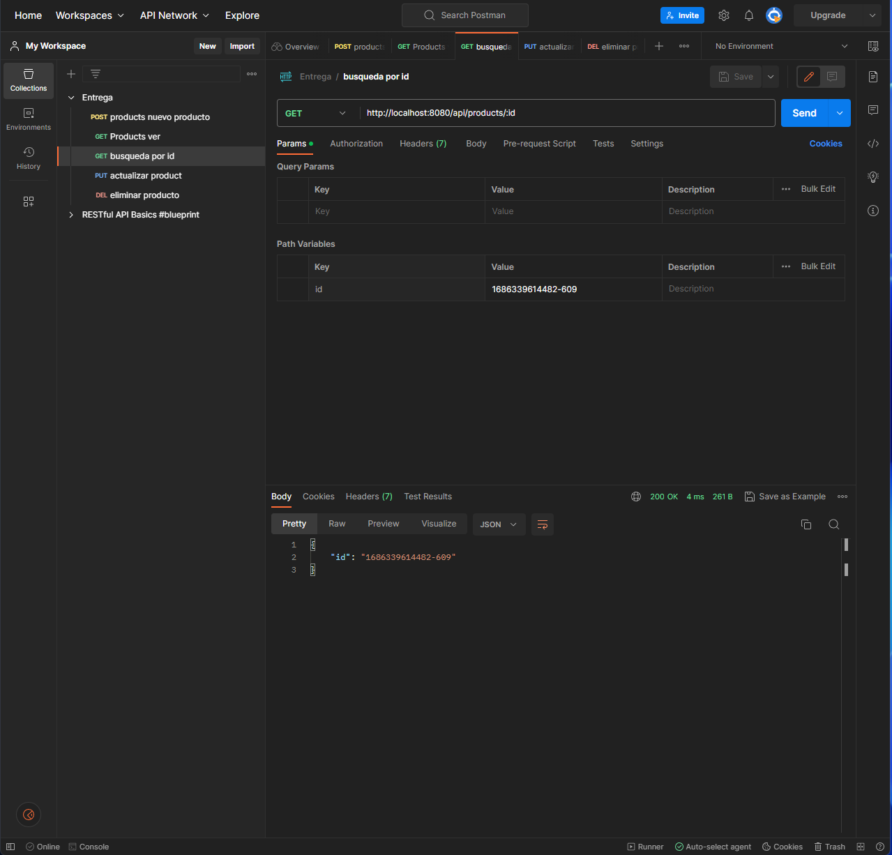
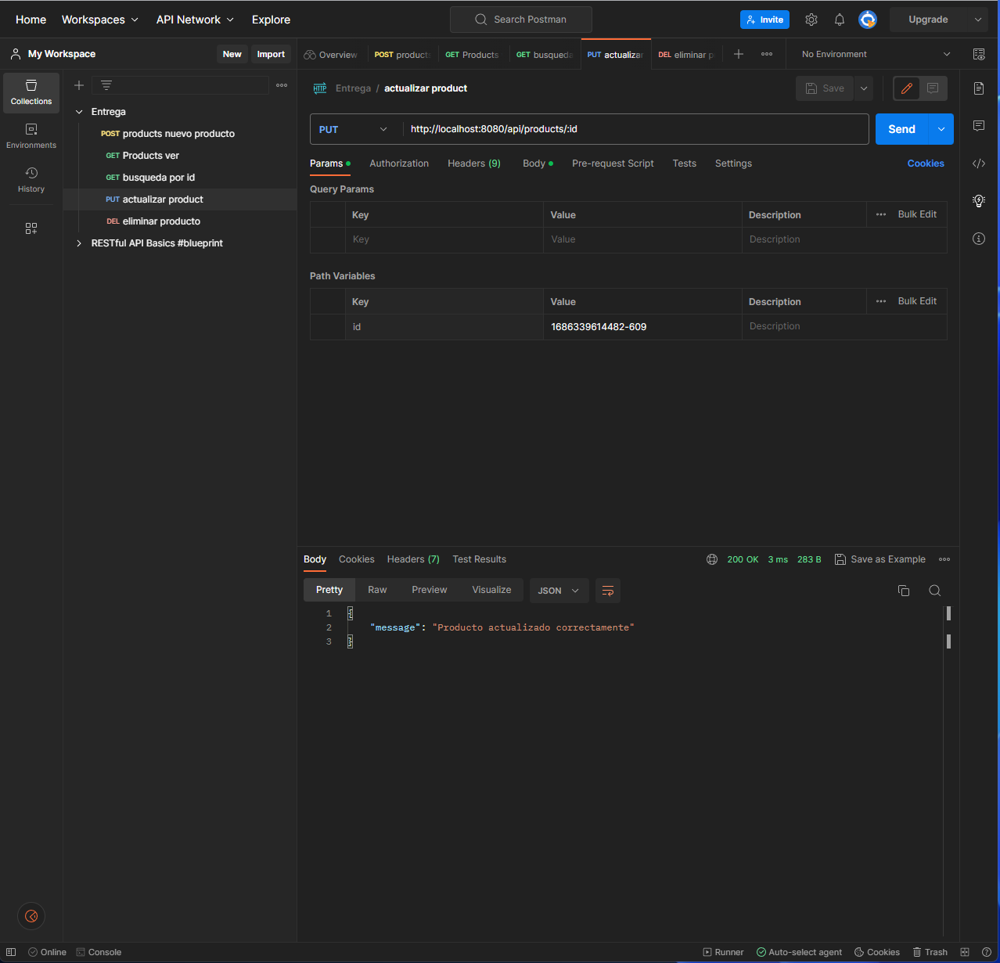
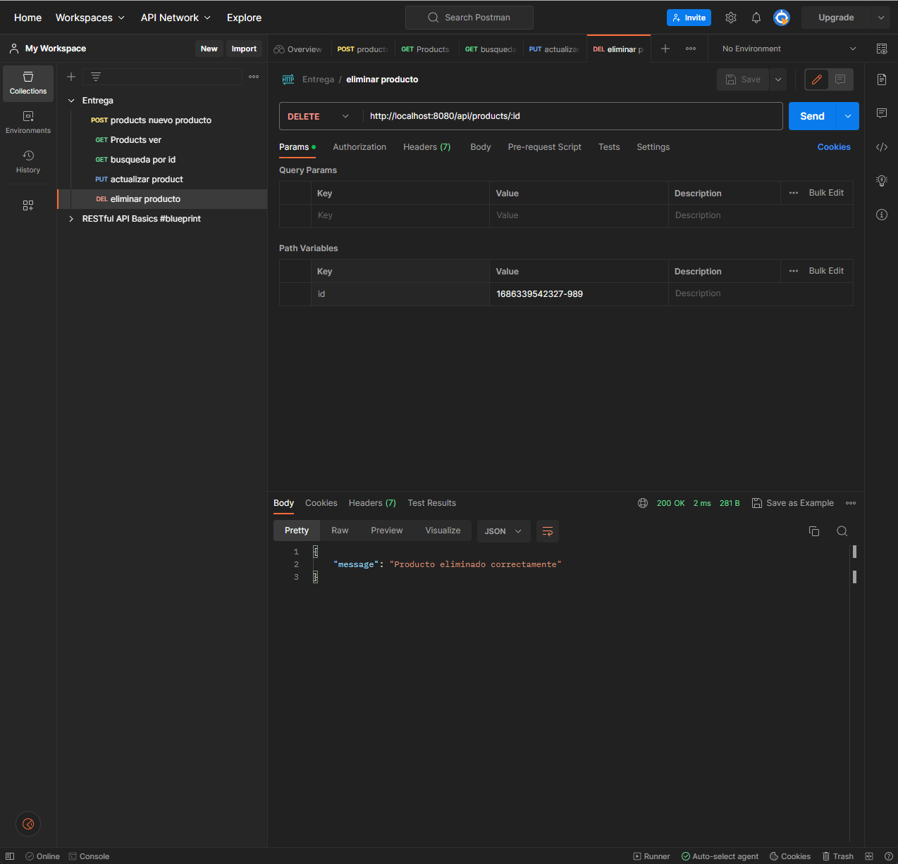
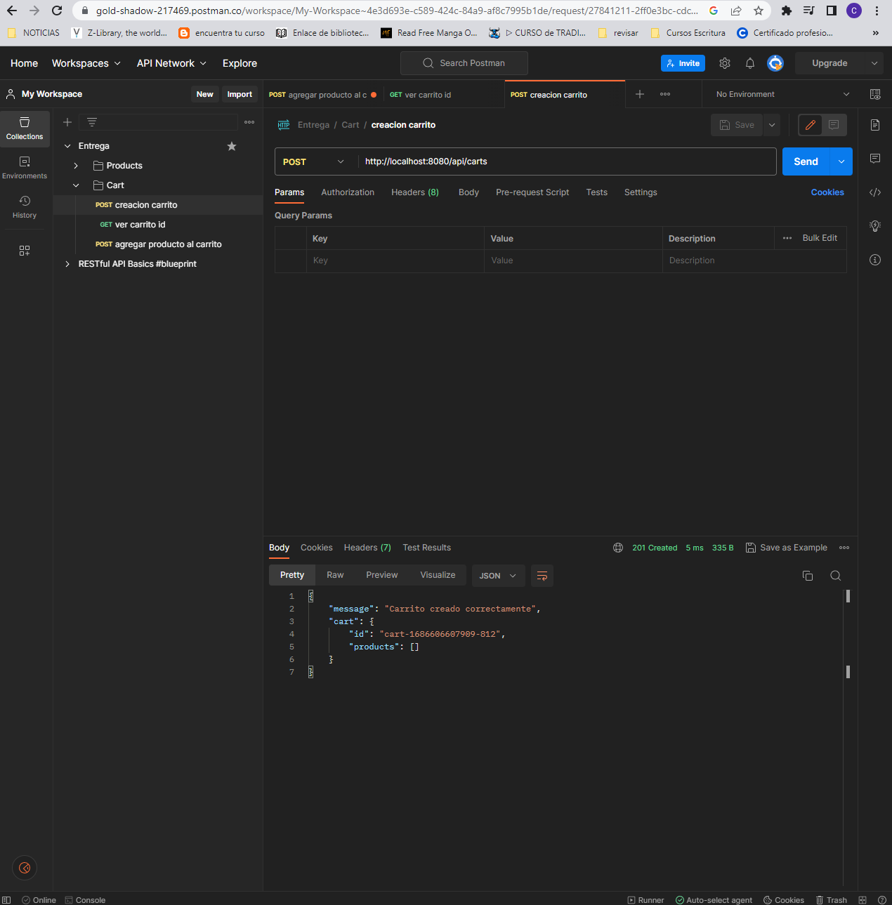
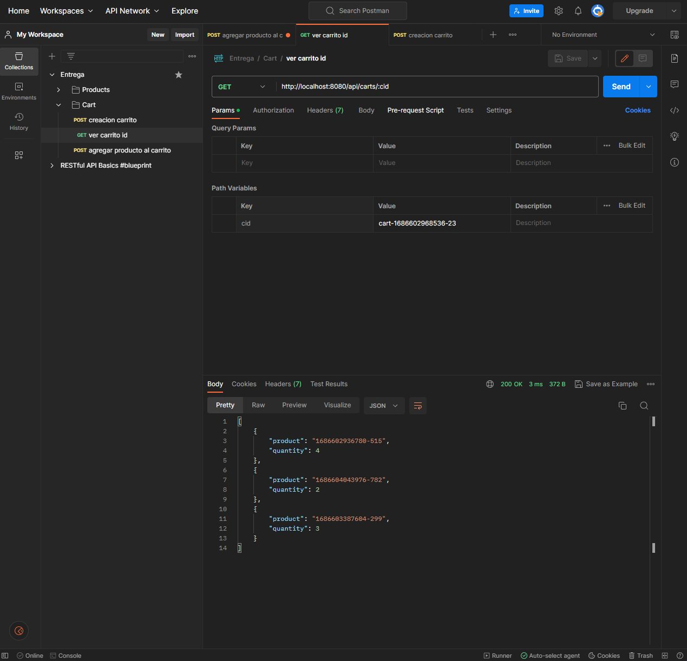
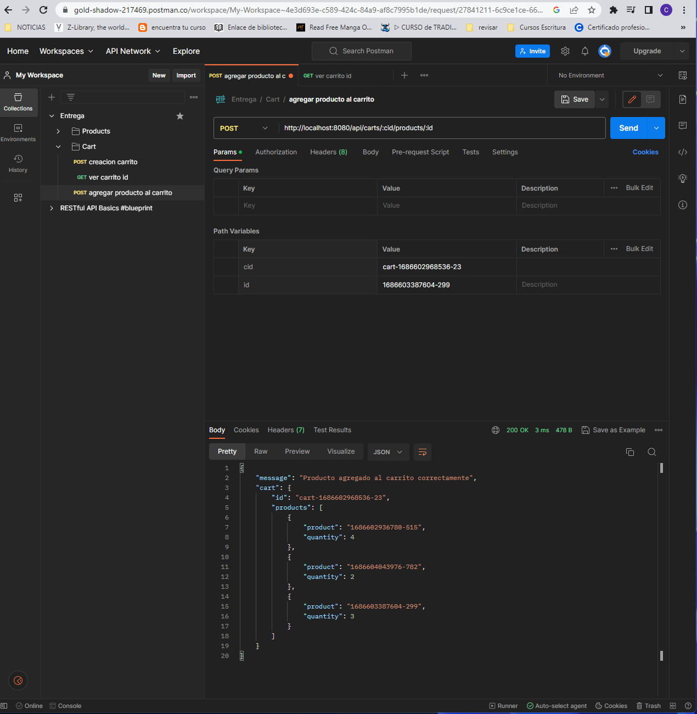

# Preentrega 1

## Endpoints de Productos

- Agregar producto: `POST /api/products`
- Ver productos: `GET /api/products`
- Buscar producto por ID: `GET /api/products/:id`
- Actualizar producto: `PUT /api/products/:id`
- Eliminar producto: `DELETE /api/products/:id`

### Ejemplos de uso

## Endpoints de Carrito

- Crear carrito: `POST /api/carts`
- Ver carrito por ID: `GET /api/carts/:cid`
- Agregar producto al carrito: `POST /api/carts/:cid/products/:id`

### Ejemplos de uso

